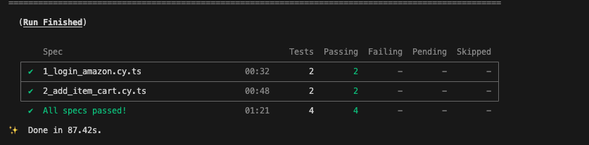

## Cypress

### Requirement

1. NodeJs v23++
2. Cypress v14
3. Chrome Browser

### Installation

- Run in terminal
  ```
  yarn install
  ```
### Data .env configuration
- Edit file cypress.env-example.json
- Set the correct username and password variables.
  ```
  {
    "username": "aaa@mail.com",
    "password": "Test123!",
  }
  ```
### Open GUI Cypress (Run Manual)

- Run in terminal
  ```
  yarn open
  ```

### Run All Test Headless

- Run in terminal
  ```
  yarn test
  ```

### Example Success Run 
  

### Report
- Path report :  'web-amazon/cypress-automation/reports'
- Path failed Screenshoot : 'web-amazon/cypress-automation/cypress/screenshots'
- path video run : 'web-amazon/cypress-automation/cypress/videos'

